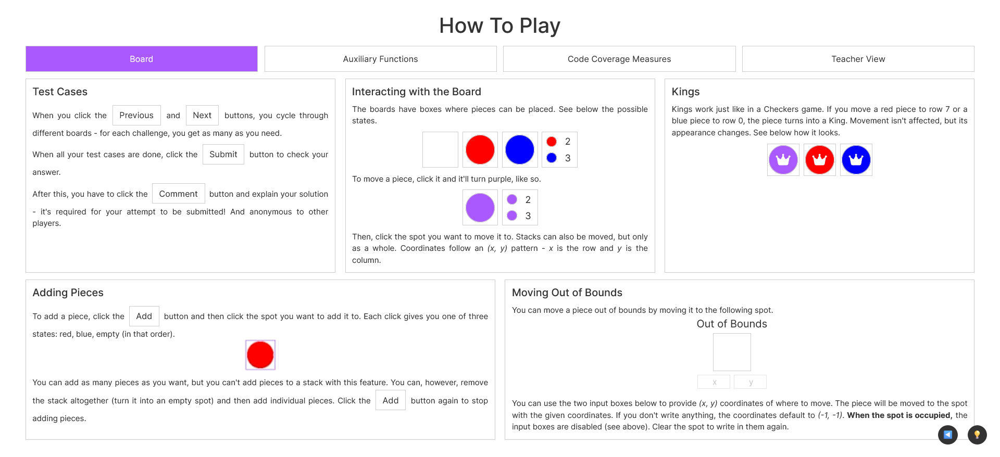
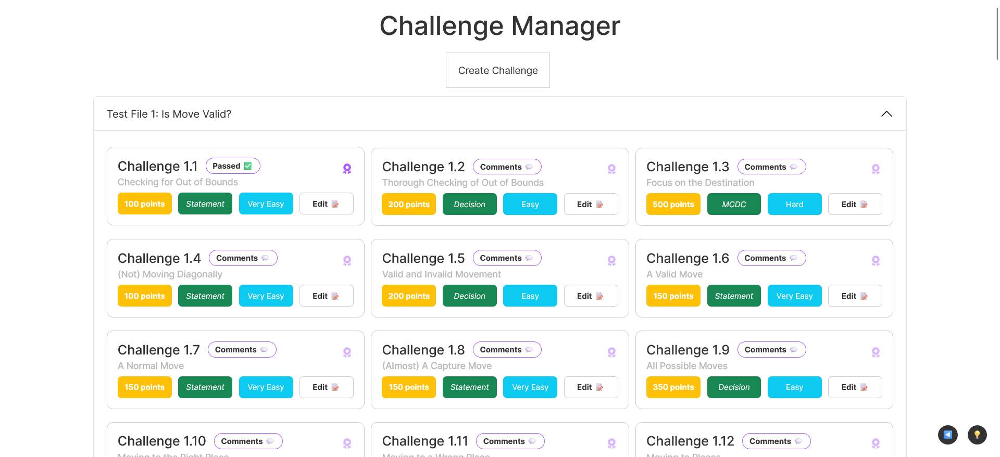

# <justify>GAMFLEW, Teacher View: Validation Experiment

This document serves as a script/guide to a validation experiment of GAMFLEW, a new serious game to teach white-box testing techniques. Please follow the instructions below to properly participate in the experiment. Please check the demonstration video in [this link](https://drive.google.com/file/d/1GHOaQfvJjSebg_ltgKpYLrIKLt0Bu9te/view?usp=sharing).

## 1. Introduction
This experiment happens at your own pace, but, as a suggestion, one should only need a maximum of 45 minutes to complete it.
There are two parts to the experiment:
1. **Part 1: Playing The Game** - to allow you to understand the game mechanics, you are to complete a challenge (as a player/student) from a provided small list of suggested challenges.
2. **Part 2: Teacher View** - after playing the game, you will be ready to take the role of a teacher and follow a short tutorial on creating your challenges for the game. After this, there is a questionnaire.
   1. **Part 2.1: Tutorial** - a step-by-step guide on creating a challenge and overview of other features.
   2. **Part 2.2: Post-Questionnaire** - a set of questions to evaluate the game and the challenge creation process.


## 2. Part 1: Playing The Game
The game is available at [this link](https://fe.up.pt/gamflew/).

To play the game, authentication is required. For your purposes, you can use the following account:
- Username: `professor`
- Password: `password`

However, if you want to create your own account, click the "Register" link on the login page. After creating it, you must validate your account to use it. You can do so using the account above (*Login -> Validate Administrators -> Find Your User -> Click "Validate"* - see guide image below (Section 3), button 2).

After authentication, you will be redirected to the game's main page. Here, click on the "Single Player" button.

You will then be on the Challenges page, which lists all challenges. 99 challenges are available, but to make it easier, we selected some challenges. **Make sure you beat one of the following**:
1. Challenge 1.1 (Statement coverage, Very Easy)
2. Challenge 1.2 (Decision coverage, Easy)
3. Challenge 1.3 (Modified condition/decision coverage, Hard)
4. Challenge 2.6 (Condition/decision coverage, Normal)
5. Challenge 2.8 (Condition coverage, Easy)

After beating a challenge, one should be familiar with the game mechanics to proceed to Part 2.

### How to Play
The game is built on a simple idea: players get a challenge containing a code and a specific coverage objective. The player must then "write" test cases to achieve the coverage objective. 

To "write" test cases, there is a board based on the game Checkers with which to interact. For each attempt, one comments on what they tried and why they think it worked.

Please check the "How to Play" page (Login -> How to Play - see guide image below (Section 3), button 1) for a detailed explanation of the controls ().



## 3. Part 2: Teacher View
There is a specific "Teacher View" tab on the "How to Play" page (see guide image below, button 1), which may be useful before this part. It is also a quick read!

The following picture shows the main page of the "Teacher View" tab. It is a simple page with a few buttons to navigate the teacher's view. We provide numbers in these buttons to guide you through the process. Come back to it anytime you need.


### 3.1 Tutorial

#### 3.1.1 The Challenge Manager Pages
To start, go to the "Challenge Manager" page (see guide picture, button 3). For this part, we invite you to open the same challenge you beat to see how it came to be and go through this section while checking it.

To do that, one has to go to an existing challenge and click the "Edit" button. One should click the "Create Challenge" button to create a new challenge.



After opening a challenge, you will see a form with several fields. The first two are the initial board state and the code file associated with the challenge. These should be familiar - you saw them when playing the challenge!


While on this page, you can only select existing entries for the initial pair of fields, you can create new ones by going to the "Challenge Content Creator" (see guide image, button 2). There, you can create new board states to initialize challenges and new code files to associate with them. They are pretty self-explanatory, only requiring a name and their content (check "How to Play" - guide image, button 1 - for more details). We will be using the page later in the tutorial.


After the first two fields, there is a standard form: this is where everything is filled up (challenge title, its objective, the hint shown to struggling students, coverage type, difficulty). There is also a field for the number of conditions to consider when generating the truth table (this is only for coverage types that warrant it).

After this, it is important to note the Assertions and Tests, below the group of purple callouts. The purple callouts explain how to write and understand what is in these expressions. Giving them a quick look is better than explaining them here. With that, it is possible to understand how the challenge passed before it is evaluated.


While both assertions and tests are simple boolean expressions, they have one thing that distinguishes them: **if a player passes a test, the assertion will have passed as well**. At the same time, **assertions are applied before every test**, so it is important to write them properly.

Take a moment to understand the expressions from your challenge - that is the format you will be using to create your challenges.

**NOTE**: For challenges with more than one test, know that it is optional for the first submitted board state to clear the first test and so on - players can submit test cases in whichever order they please! What matters is that, when finishing the evaluation, all tests were cleared at least once.

#### 3.1.2 The Challenge Content Creator
Go to the "Challenge Content Creator" page (see guide image, button 2) to start your challenge creation process.

We are providing you with a simple code file to keep this simple.

Use the "Code File" tab to create a code file with the following code (you write on the right text area and see the appearance on the left):
```javascript
// This is a simple function to move a piece in a checkers-like game.
// start: object with initial (x, y) coordinates of the piece that was moved.
// destination: object with (x, y) coordinates to where piece was moved
function makeAMove(start, destination) {
    if (Math.abs(start.x - destination.x) === 1 && Math.abs(start.y - destination.y) === 1) {
        return true;
    } else {
        return false;
    }
}
```

We recommend you name it *"Code File 0: Make A Move"*. You can give it any name as long as you can identify it. After this, submit it, using the respective button.


Now, for the board state, you can make any board state you wish, as long as you submit it and give it an identifiable name for you to select in the "Challenge Manager" (see guide image, button 3). When making the existing challenges, we made initial board states that either created little work for the players or made the challenge more interesting.

If you want a suggestion: add one piece (red or blue) to the board, as that is all that is needed for the challenge!

After submitting the new board state, head to the "Challenge Manager" page (see guide image, button 3) and click the "Create Challenge" button to create a new challenge.

#### 3.1.3 Creating a Challenge
The idea is to create a challenge for one of the return lines. The first thing to do is select the code file and board state you created in the previous step.

We will use the `return true;` line for this challenge. As such, fill out the form with the following information:
- Challenge Title: "Challenge 0.0: A Simple Move"
  - **[NEW CODE FILES WILL BE LISTED AT THE BOTTOM WHEN LISTING CHALLENGES - BEWARE OF THIS FOR LATER!]**
- Objective: "Statement coverage of line 6."
- Coverage Type: "Statement"
- Difficulty: "Very Easy"
- Score: 100 points (but you can give it any score you wish)
- Hint: "If the difference between the respective X and Y in start and destination is the same, what does that mean for the piece's movement? Think geometrically. Remember that only the last movement is considered."

After this, it is time for assertions and tests. We will make one for each. 

From the ``if`` statement above it, the function returns True if the piece is moved by one spot diagonally. As such, the test should check if the condition yields True. Using the "language" expressed in the purple callouts above the expression maker, we can see any logged interaction with the board - including movements. For the purpose here, we need something like below (using the abbreviations). Put it in the *T1* textbox!

```javascript
Math.abs(last_start.x - last_destination.x) == 1 && Math.abs(last_start.y - last_destination.y) == 1
```

We are missing the assertion, now. The assertion should always be True when the test expression is True. In this case, we can use the following (in the *A1* textbox):

```javascript
board.log.length > 0
```

With this, we ensure that at least one interaction is logged on the board. Without interactions, there cannot be movements, meaning the test cannot pass. It is a very simple assertion, but it also prevents false positives!

With both of these in respective boxes ("A" for Assertion, "T" for Test), the Challenge Creator should already have updated everything needed. So all that is left is passing the challenge. Because there is nothing like trying what we did to ensure it works as intended!

At this point, it is repetitive, but the challenge will pass by moving a piece one spot diagonally and submitting.

Passing the challenge unlocks the "Submit Challenge" button, and when you press it, the challenge is submitted! From then on, the challenge will be available to all players.

Go back to Single Player mode and play it yourself! After submitting an attempt, move on to the next step.

#### 3.1.4 Check Leaderboard
You can check the leaderboard if you want to see how players are doing in your challenge. This leaderboard keeps all user stats, which is different from what leaderboard players have access to. 

Go to the "Leaderboard" page (see guide image, button 4) and look for your username!


#### 3.1.5 Check Solutions
After submitting the challenge, you can check the solutions submitted by players.

To do so, go to the "Check User Submissions" page (see guide image, button 5). Here, select your challenge and your submission, which should be easy to track down (it uses your username).


### 3.2 Post-Questionnaire
After playing the game and creating a challenge, please complete the post-questionnaire. It is available [on this link](https://forms.gle/SNPudoTt7M3zjNgj7).

## 4. Conclusion
Thank you so much for participating in this experiment. Your feedback is very important to us, as it will help us improve the game and the challenge creation process.

For any further contacts, please reach out to us!</justify>