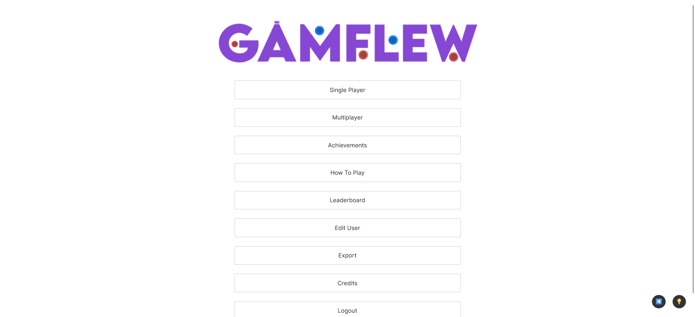
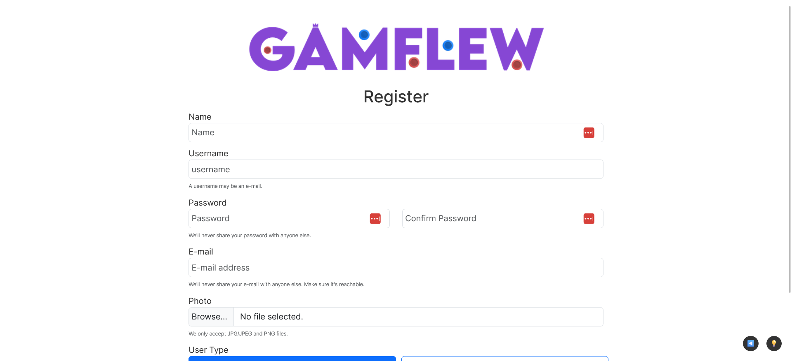
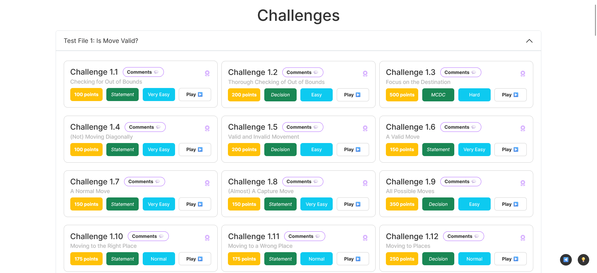
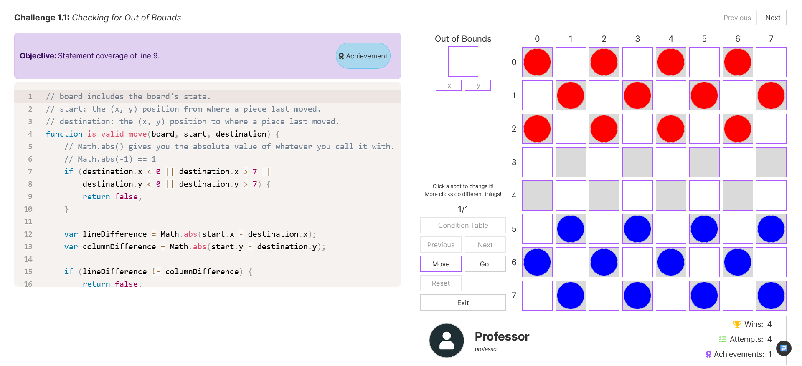
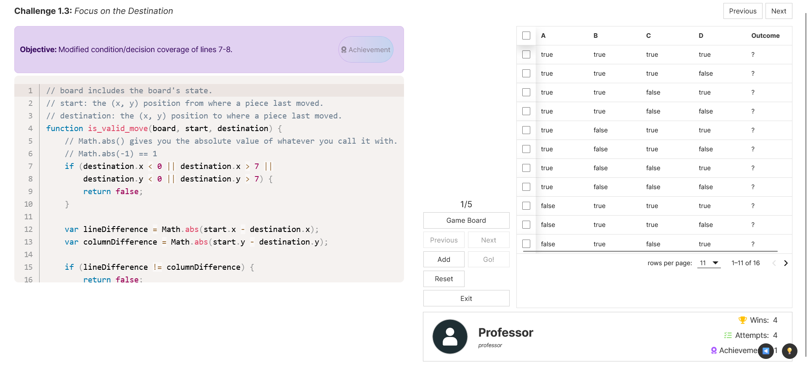
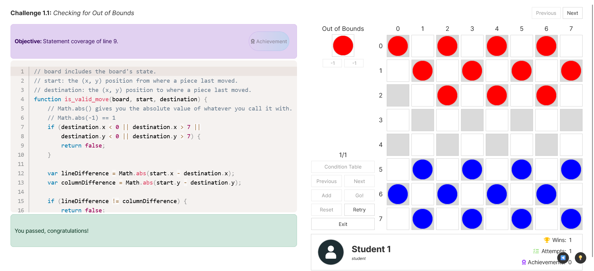
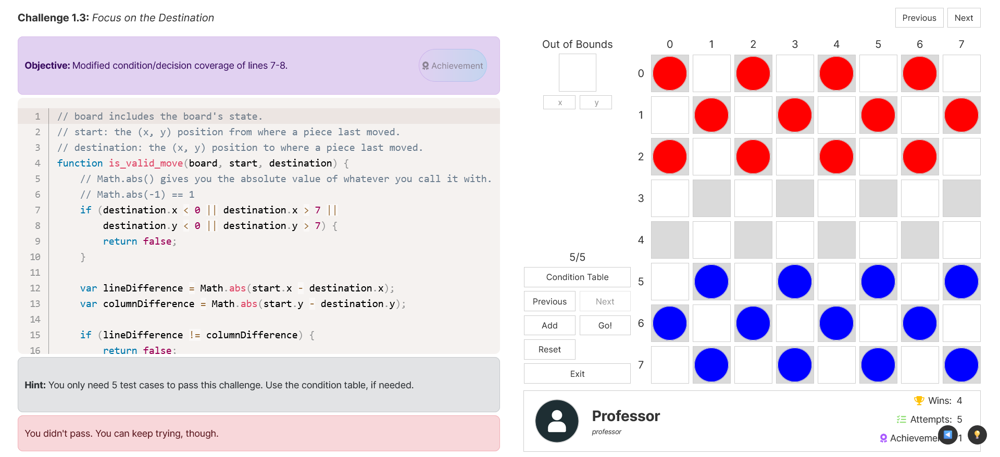
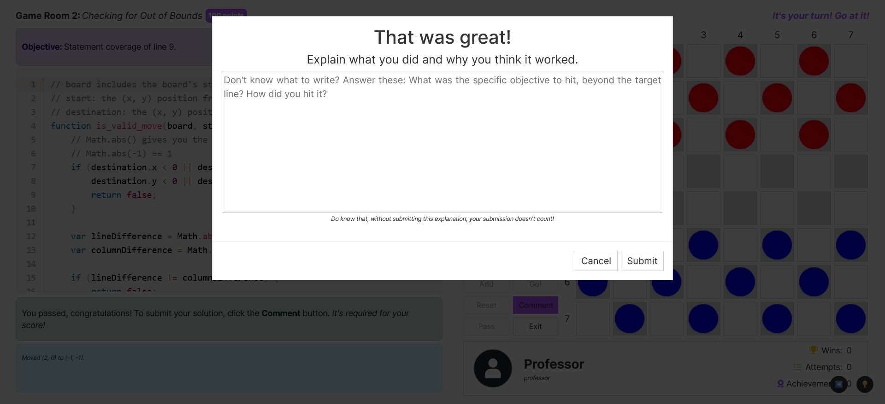
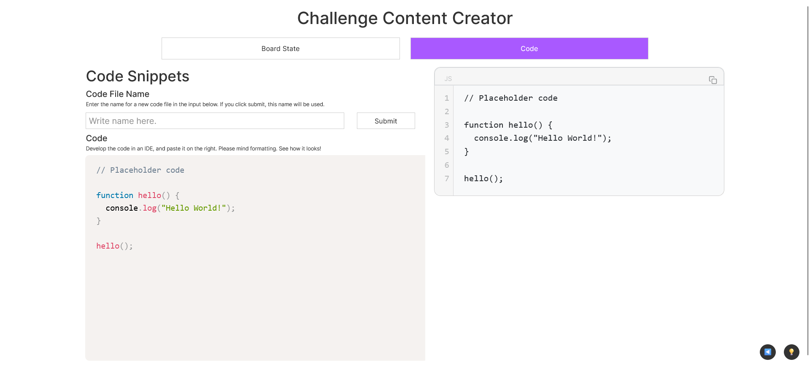

# GAMFLEW: User Manual

Written by Mateus Silva, 2024.

## Table of Contents
- [GAMFLEW: User Manual](#gamflew-user-manual)
  - [Table of Contents](#table-of-contents)
  - [Introduction](#introduction)
  - [Using the Application](#using-the-application)
    - [General Usage](#general-usage)
      - [Authentication](#authentication)
      - [Registering a New Player User](#registering-a-new-player-user)
    - [Player User](#player-user)
      - [How to Play](#how-to-play)
      - [Single Player Mode](#single-player-mode)
        - [Challenges](#challenges)
        - [Playing a Challenge](#playing-a-challenge)
          - [Challenge Objective and Challenge Hint](#challenge-objective-and-challenge-hint)
          - [Interaction Log](#interaction-log)
          - [Movement](#movement)
          - [Stacks](#stacks)
          - [Out of Bounds Spot](#out-of-bounds-spot)
          - [Adding and Removing Pieces](#adding-and-removing-pieces)
          - [Changing Test Cases](#changing-test-cases)
          - [Condition Table](#condition-table)
          - [Validating and Submitting](#validating-and-submitting)
    - [Admin User](#admin-user)
      - [Single Player Mode](#single-player-mode-1)
      - [Creating and Managing Challenges](#creating-and-managing-challenges)
        - [Challenge Content Creator](#challenge-content-creator)
          - [Creating a Board State](#creating-a-board-state)
          - [Creating a Code File](#creating-a-code-file)
        - [Creating a Challenge](#creating-a-challenge)
          - [Challenge Creator / Editor](#challenge-creator--editor)
  - [Troubleshooting](#troubleshooting)
  - [Conclusion](#conclusion)

## Introduction
**GAMFLEW** stands for *GAMe For LEarning White-box testing*, and intends to provide you a motivating and engaging way to learn about concepts in white-box testing. This document will guide you through the usage of the application if you need it.

## Using the Application

### General Usage
This section covers features that are accessible to all users.

#### Authentication
To use the application, you need to authenticate. The authentication page is the first thing you'll see when opening the game. There are two types of users: *Player* and *Admin*. The *Player* type is for students, and the *Admin* type is for teachers. Both use the same aforementioned page. 

The default credentials are:
- *Player*:
    - username: student
    - password: password
- *Admin*:
    - username: professor
    - password: password

The Main Menu includes a "Logout" button to log out of the application.

#### Registering a New Player User
If you wish to register a new **Player** user, you can do so by clicking the "Register" link in the login page, just below the Login button.

Beware users must have unique usernames and e-mails. It is also required that you provide a picture (avatar) for your user.

### Player User
The following section goes through the features available to **Player** users.

#### How to Play
For a summarized explanation of how to play, you can click the "How to Play" button in the main menu. This will open a new tab with a brief explanation of the most elusive game mechanics. Know that this guide is more comprehensive.

#### Single Player Mode
The main feature for **Player** users is the single player mode. In this mode, you can access challenges and try to solve them. The challenges are grouped by code file, which corresponds to a code snippet that you are expected to analyze when solving a challenge.
To access the challenge page, just click the "Single Player" button in the menu.
From here, you can select any challenge you wish to play.

##### Challenges
Challenges are also classified by type of code coverage, score and difficulty.

- **Code Coverage**: The type of code coverage that the challenge is about, there are only five types (Statement, Decision, Condition, Condition/Decision, Modified Condition/Decision).
- **Score**: The score is the amount of points you can get from solving the challenge. The score is also related to the difficulty of the challenge.
- **Difficulty**: The difficulty is a measure of how hard the challenge is.

When you select a challenge, you will be taken to the challenge page.

##### Playing a Challenge
To play a challenge, you should be aware of the following mechanics.

###### Challenge Objective and Challenge Hint
The challenge objective is the code coverage objective you need to hit to solve the challenge, it is above the code snippet shown to you in the challenge page, to the left.
The challenge hint is a hint to help you solve the challenge. It is also to the left and below the code snippet.

###### Interaction Log
Below the Challenge Hint, when you perform any sort of interaction that changes the board state, a blue component will log each and every of your interactions. This is useful for you to keep track of your movements and to understand how the board state changes, especially in challenges with multiple test cases.

###### Movement
You can move pieces by clicking them once to select them (they turn purple) and then click the space you wish to move them to.

###### Stacks
You can stack pieces by moving a piece to an already ocuppied spot. You can also select a stack by clicking on it, and then move the whole stack to another spot.

###### Out of Bounds Spot
The board possesses an out of bounds spot, to which you can move the pieces. This spot is appropriately labelled "Out of Bounds" and, below it, it has two input boxes for you to input the coordinates of the spot you wish to move the pieces to. The input boxes are labelled *x* and *y*, for the horizontal and vertical coordinates, respectively.
When the out of bounds spot is occupied, the input boxes are disabled. You can only write in them when the spot is empty.
If you move a piece to the out of bounds spot without filling the input boxes, its coordinates default to the *(-1, -1)* position.

###### Adding and Removing Pieces
There is an "Add" button to the left of the board. Click it, and the board will have its borders turn purple. You can then click on any board spot to change its pieces:
- Clicking an empty spot will add a red piece.
- Clicking a red piece will turn it blue.
- Clicking a blue piece or a stack will make the spot empty.
Whenever the board is in Add Mode (purple borders), you can't change between test cases.

###### Changing Test Cases
For challenges with multiple test cases, you can change between them using the "Next" and "Previous" buttons. You can only verify your submission on the final test case. Don't worry, your interactions are logged for each test case and saved appropriately.

###### Condition Table
The "Condition Table" switches between the board's state and a pre-generated condition table to help you in challenges that feature condition, condition/decision or modified condition/decision coverage.
This table is filled with the number of variables corresponding to the challenge, which may be useful for you to keep track of the test cases you need to cover. You can even mark the covered test cases with a check box.

###### Validating and Submitting
When you think you've hit the code coverage objective, you can click the "Go" button. This will check if you've hit the objective. If you have, the left side of the Challenge page will show you a green callout, telling you you've passed the challenge.

Otherwise, a red callout will appear prompting you to try again.

No matter if you pass the challenge, you should comment on your attempt. This is what makes it possible for you to submit your attempt. This is done by clicking the "Comment" button and writing your comment in the input box that appears. If you don't comment, your attempt won't be saved, even if you've passed the challenge. This is how you progress in the game, as a successful commented attempt will notify you of how much points you've just earned on the bottom left of your screen.

You can submit attempts even if you haven't passed the challenge as a checkpoint for what you've tried. They're only used for statistics and are not mandatory.

### Admin User
The following section goes through the features available to **Admin** users.

#### Single Player Mode
Exactly like the **Player** single player mode.

#### Creating and Managing Challenges
This section covers the challenge management and creation features of the application.

##### Challenge Content Creator
After authenticating, the "Challenge Content Creator" button is available. This page allows an *Admin* to create their own Code Files and Initial Board states to store in the database.
- The Code Files are code snippets that the players analyze to hit code coverage objectives.
- The Initial Board states are the initial state of the board when a challenge is started.
The page has two tabs, one for each of the mentioned entities.

###### Creating a Board State
To create a board state, you need to fill in the following fields:
- **Board State Name**: The name of the board state, which must be unique.
- **Board State**: The board state itself. You can interact with a given board to change its state, just like in a real challenge.
If the user wishes, they can load an existing Board State to edit it. This is done by selecting the Board State from the dropdown menu provided in this tab.
After filling in the fields, the user can click the "Submit" button to save the board state to the database. They'll be greeted with an alert if everything goes well.

###### Creating a Code File
To create a Code File, the second tab provides:
- An input box for the Code File name, which must be unique.
- An input box for the Code File content, which is the code snippet that the players will analyze to hit code coverage objectives.
- A Code Block to preview the code snippet in real time.

After filling in the fields, the user can click the "Submit" button to save the new code file to the database. They'll be greeted to an alert if everything goes well.

##### Creating a Challenge
Creating a challenge requires a few fields. More specifically, it requires a given Code File and an Initial Board State. These two may be created by an *Admin* user, as explained in the previous sections.
To create a challenge, the user should open the Challenge Manager page, which can be accessed by clicking the "Challenge Manager" button in the main menu.
The Challenge Manager page has a "Create Challenge" button, which opens a form to create a challenge. Below it, the existing challenges are listed, allowing an *Admin* to edit existing challenges.

###### Challenge Creator / Editor
The first two things an *Admin* needs to select are the code file and the initial board state, which can be created using the Challenge Content Creator. After this, the form has asks for a few fields:
- **Name**: The name of the challenge, which must be unique.
- **Description**: A brief description of the challenge.
- **Coverage Type**: The type of code coverage that the challenge is about, there are only five types (Statement, Decision, Condition, Condition/Decision, Modified Condition/Decision).
- **Score**: The score is the amount of points you can get from solving the challenge. The score is also related to the difficulty of the challenge.
- **Difficulty**: The difficulty is a measure of how hard the challenge is.
- **Hint**: A hint to help the players solve the challenge.
- **Objective**: The code coverage objective you need to hit to solve the challenge.
- **Condition Count**: The number of variables in the covered condition of the challenge, if applicable (only for Condition, Condition/Decision and Modified Condition/Decision challenges).

After filling these fields, the *Admin* can work with the Test Expressions Maker. This component allows the user to create test expressions for the challenge. These expressions are supposed to be written in JavaScript and be evaluated to a boolean value - meaning that "True" means a pass and that "False" equals a fail.

The test expressions are divided into two types: assertions and (actual) tests. The tests are the crux of the challenge: they verify if a submission passes or not the challenge's code coverage objective. Assertions, however, are used as shortcut evaluations of the tests. If an assertion fails, the test is not even evaluated. This is beneficial for performance reasons, as the tests can be quite complex and time-consuming to evaluate. The golden rule with assertions is: **if an assertions fails, the test fails, *but* if an assertion passes, a test may still fail**.

The user can add and remove test and assertions expressions, which get labelled AX and TX, where X is an expression index, only, counted separately for each type of expression. Assertions are not mandatory to be added, but at least 1 test case is required for each challenge. **Please note that assertions are verified *before* each test case expression globally: that is, assertion A1 isn't just executed before test T1, but before all tests (T1, T2, T3, ...).**

To write expressions, the user has a powerful abstract implementation of a language to use, based on JavaScript, that is explained just above the input boxes, in purple callouts. This language uses only boolean operators and relevant parameters (such as "board").

After making their expressions, the *Admin* will be able to submit the challenge *after* submitting a valid attempt at passing it (as if playing it). This is so invalid expressions cannot be saved in the database, so, to submit a challenge, the *Admin* needs to pass the challenge they've created.

If they pass, a "Submit Challenge" button will become available. Clicking it will save the challenge to the database. The user will be greeted with an alert if everything goes well.

## Troubleshooting
- The application is programmed to redirect you whenever a network error happens. If you see a page similar to the one below, it means that the application redirected you after an error. Simply try again, and if the error persists, contact the developer.

  - If you see that accuses a **401 Unauthorized** error, it means you've just been logged out. Go back to the main page and log in again. Beware that closing a tab will log you out.
  - 

## Conclusion
This document has covered the usage of the **GAMFLEW** application. If you have any questions, feel free to contact the developer. Enjoy the game! 
